# MOAT, visually

A diagram-first companion to the [README](README.md). Each section is one idea,
one picture, and a few lines of caption -- read it top to bottom as a
presentation, or jump to the piece you need. All diagrams are Mermaid, so
GitHub renders them in place.

---

## 1. The big picture

MOAT in one line: CUDA-only projects go in, and at most one human-approved
pull request per project comes out. Everything inside the middle box -- five
agents, state files, forks, gates -- is what the rest of this page unpacks,
starting with the pipeline in the next section.

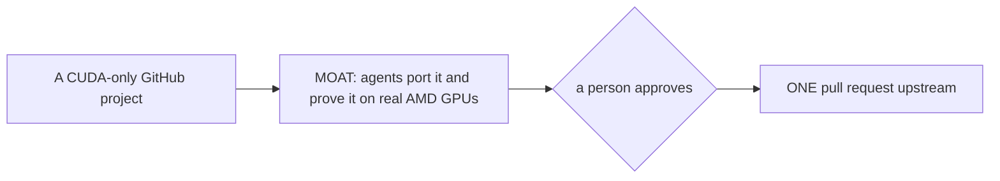

What the person approves is exact: the diff, the PR title and the PR body,
together on one page, and the submission step refuses if any of the three
changed since. Section 7 shows that gate in detail.

---

## 2. The pipeline

Five agents hand a project forward through a shared status file, never a
conversation, so either supported agent harness on any machine can pick up where the last
one stopped. Intake
screens licence, duplicates and portability; the planner analyses the build
system and the CUDA surface; the porter writes the port on the fork; the
reviewer reads the diff; the validator builds it and runs the project's own
tests on a real AMD GPU. Review comes before validation on purpose -- reading
a diff is cheap, hours of GPU build are not. Two loops send work back to the
porter.

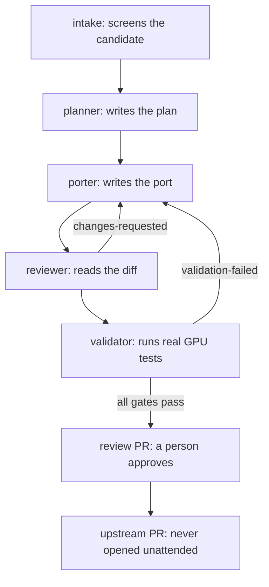

---

## 3. Project states

Each project carries a small status file naming its current stage, and moving
that file forward is the handoff: any machine can read where things stand and
continue, and no stage can be skipped. Two exits end a project early, and both
still count as finished work -- a person declining it, and a person recording
that it cannot be ported.

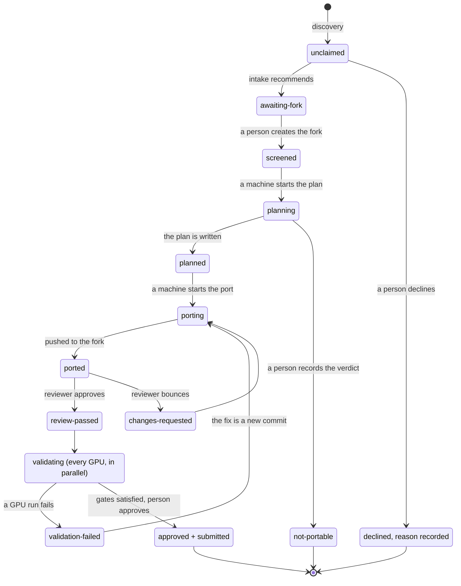

---

## 4. Two things called "the port branch"

The same nickname covers two branches in two different repositories, doing two
different jobs. In the MOAT repo, `port/<name>` holds a project's paperwork --
its status file, plan and notes -- while the project is being worked; the
branch existing is also how every other host knows the project is taken. When
the project finishes, it merges into `main` and the paperwork becomes part of
the permanent record. On the fork, `moat-port` holds the actual code changes,
and it is what the upstream pull request is opened from; the fork's default
branch is left as an untouched copy of upstream.

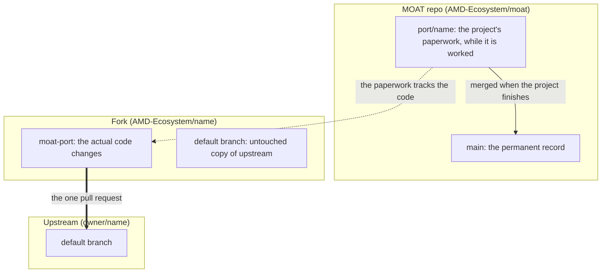

Once that pull request is open, `moat-port` freezes: it is the PR's head, so a
push to it is visible to the maintainer immediately. A requested fix is built and
proven on a third branch, `moat-fix-<pr#>`, and only an approved fix round
fast-forwards `moat-port` -- so the pull request only ever gains commits a person
approved.

---

## 5. Coverage is gates, not GPUs

No specific GPU model is required anywhere. Every machine that shows up
reports what it is -- its operating system and its GPU family -- and that
alone determines which gates it can prove. A gate is satisfied once any one
machine with the right property has validated the current code, so two
machines can cover everything; more machines only strengthen the evidence.
`windows` is the one gate MOAT's maintainer may waive.

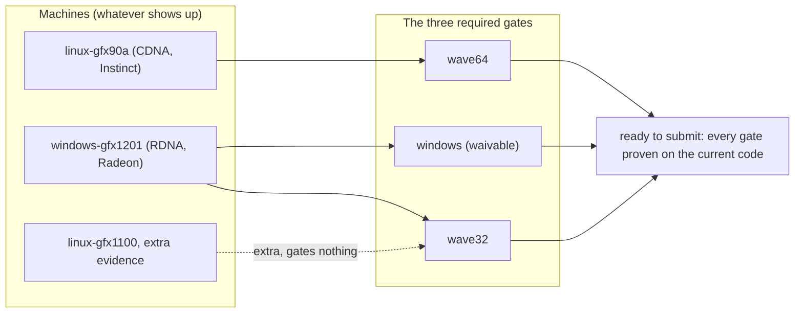

Why two widths: an NVIDIA warp is always 32 threads; AMD wavefronts are 64 or
32 depending on the card family. Code that silently assumes 32 is the single
most common way a CUDA port breaks, so each width is proven separately rather
than assumed to follow from the other.

---

## 6. What a person decides

Agents do the work itself -- the entire pipeline of section 2 is theirs, from
screening through porting to running the tests on real GPUs, along with every
record written on the way. This section is about the four moments that work
pauses: decisions that never belong to an agent, each enforced by tooling
rather than remembered. For each one, an agent prepares the material and a
person owns the verdict. A fifth record -- an upstream maintainer telling us
to stop -- is the one an agent may write alone, because it is someone else's
decision about us and can only ever mean less work.

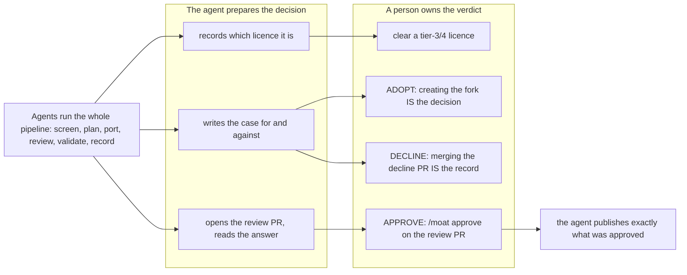

---

## 7. The approval gate, end to end

Nothing is visible upstream until a person on our side -- MOAT's own
maintainer -- has approved it, and the approval happens on our own fork: a
review pull request carries the code, the title and
the body of the future upstream PR on one page, so approving it approves
everything a maintainer will ever see. It does not even open until automated
checks pass -- the writing is free of our internal vocabulary, the licence is
cleared, and every gate has its passing GPU run. An approval covers exactly
what was on screen when it was given: a commit pushed afterwards, or an edit
to the text, and the publish step refuses. That check asks GitHub itself
rather than any local file, so no record an agent can write can revive a
stale approval.

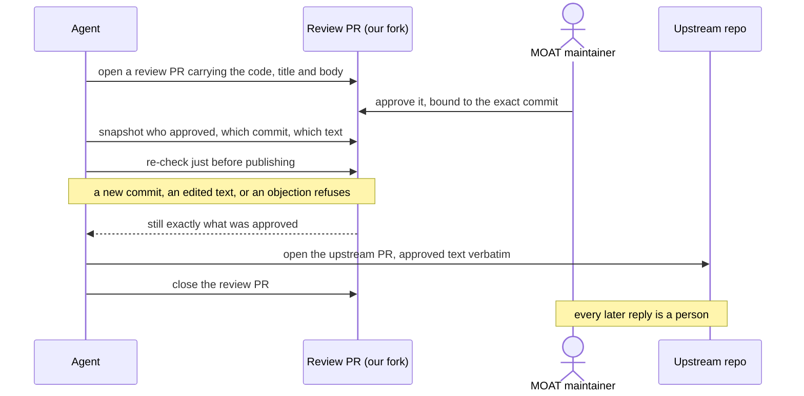

---

## 8. A test result is pinned to one commit

A pass proves the exact commit it ran against, and a failure indicts that same
commit -- neither says anything about code it never saw. So every new commit
on the port raises the question: do the old results still count? A change that
cannot affect the compiled program (documentation, comments, CI configuration)
carries the earlier results forward, passes and failures alike -- a change
like that cannot have been the fix for anything. A change that could affect
the program, or any doubt at all, sends every GPU that had passed back to
real hardware.

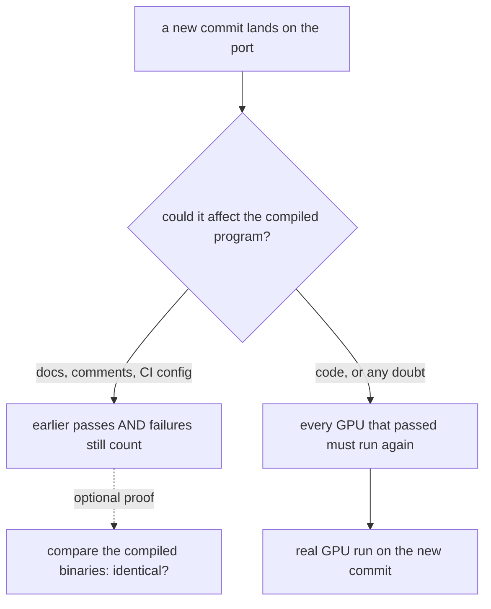

The binary comparison is exact: even a rename that alters one symbol in the
compiled output counts as different and goes back to real hardware.

---

## 9. Many machines, one lock

Several machines work MOAT at once, and any of them may pick up a project --
there is no designated leader. So that two machines never write the same
files at once, the two stages that produce a shared artifact -- the plan, and
the port itself -- are held by one machine at a time. The lock is taken and
released as part of moving between stages, never edited by hand. A machine
can stop mid-stage (a session ends, a host goes away) and leave the lock
held, and there is deliberately no timeout to recover it: from the outside, a
machine grinding through an hours-long GPU build looks exactly like one that
is gone, and a timeout would steal work from the slow one. Only a person
decides the holder is not coming back. Everything else needs no lock: every
GPU validates in parallel, and reporting a failed run or review feedback
never waits.

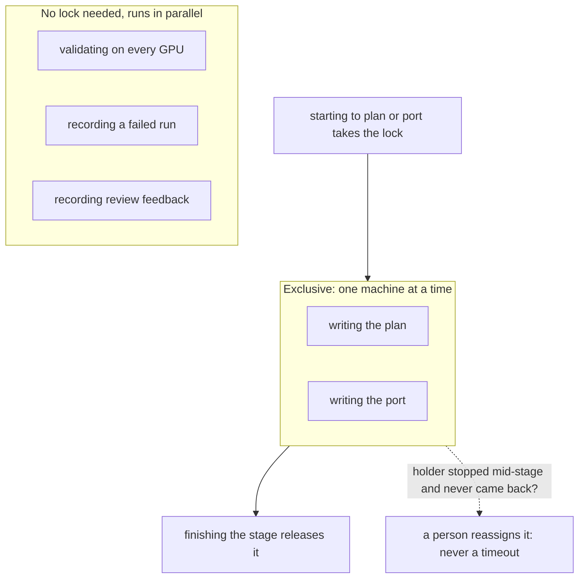

---

## 10. When a project depends on a project

Some projects need another project in order to build: `barney` links against
`cuBQL`, so porting barney means having a ported cuBQL to build on. That need
is written into the project's own records, and no machine starts on a project
until everything it needs has an answer. Four answers are possible, each with
its own move -- and the valuable one is "never": a dependency that will not
be ported is discovered before any work starts, not hours into a failed
build.

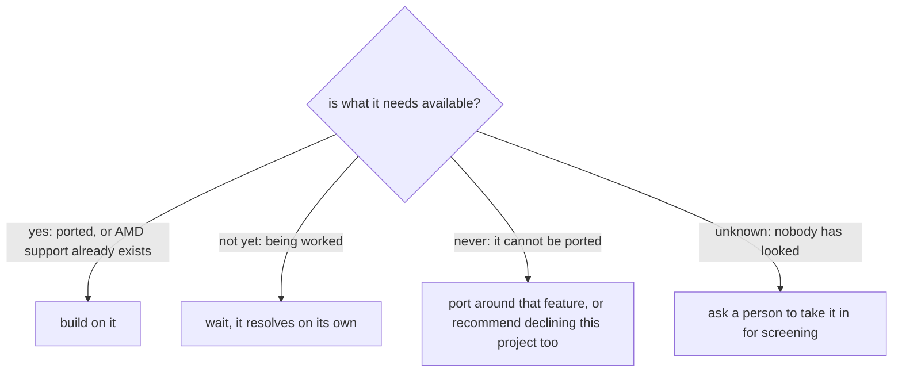

---

## 11. Where a lesson goes

One test decides: would this help someone porting a DIFFERENT project? If
not, it stays in that project's own notes with the build recipes and
maintainer correspondence. If yes, it is promoted into the shared porting
playbook every future port reads. Promoted lessons ride with the port that
produced them, so a person reviews the lesson and the code together before
the playbook changes for everyone.

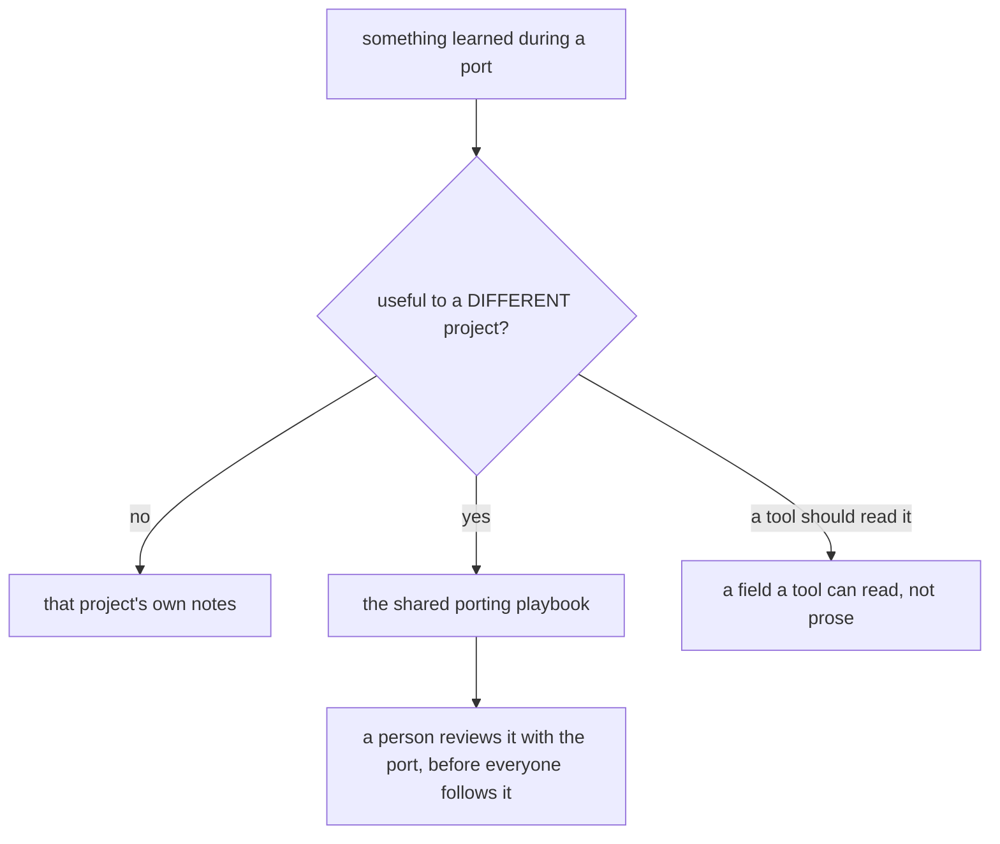

---

## 12. The upstream maintainer's view

Everything above collapses to this for the maintainer of an upstream project
receiving one of our pull requests -- a different person from MOAT's own
maintainer, who approved it in section 7. Telling us to stop is not a stage
in the flow: it works at any point -- before we ever look at the repo, mid
port, when the pull request appears, or after everything is finished -- and
it covers work already done, not just work not yet started. Once recorded it
is enforced by the tooling: the repo drops out of discovery, nothing can be
adopted from it, and nothing can be submitted to it.

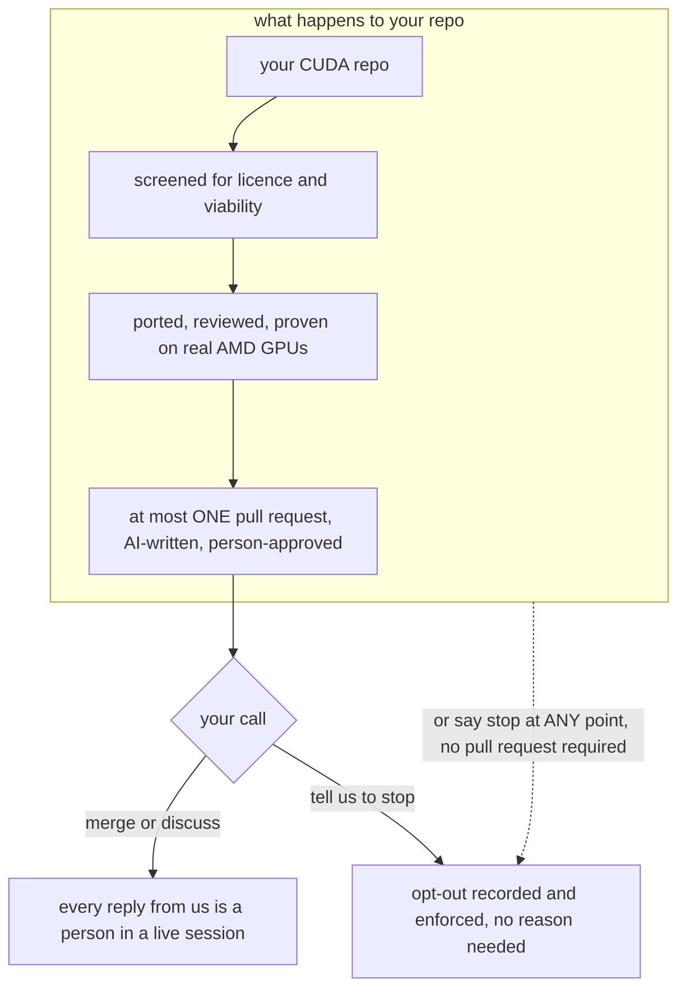
